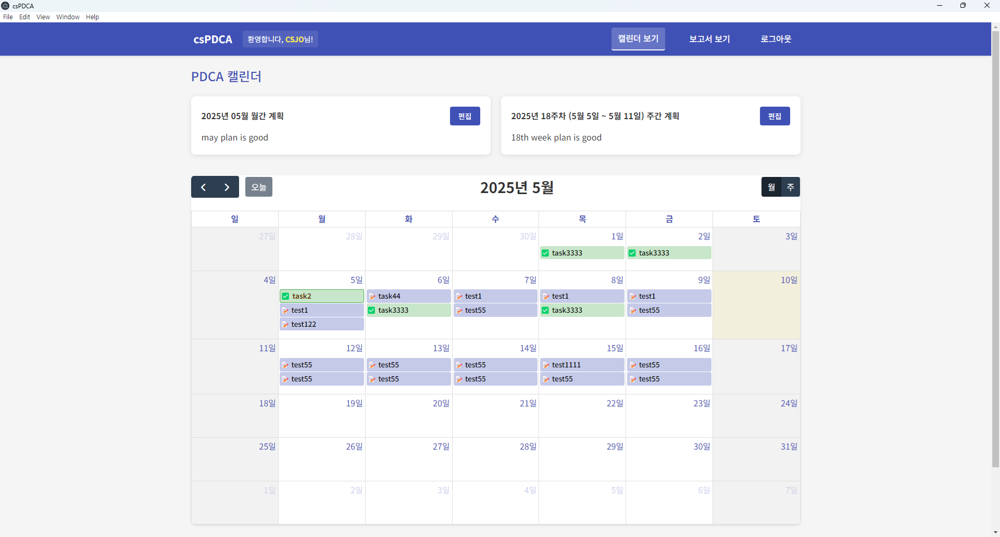
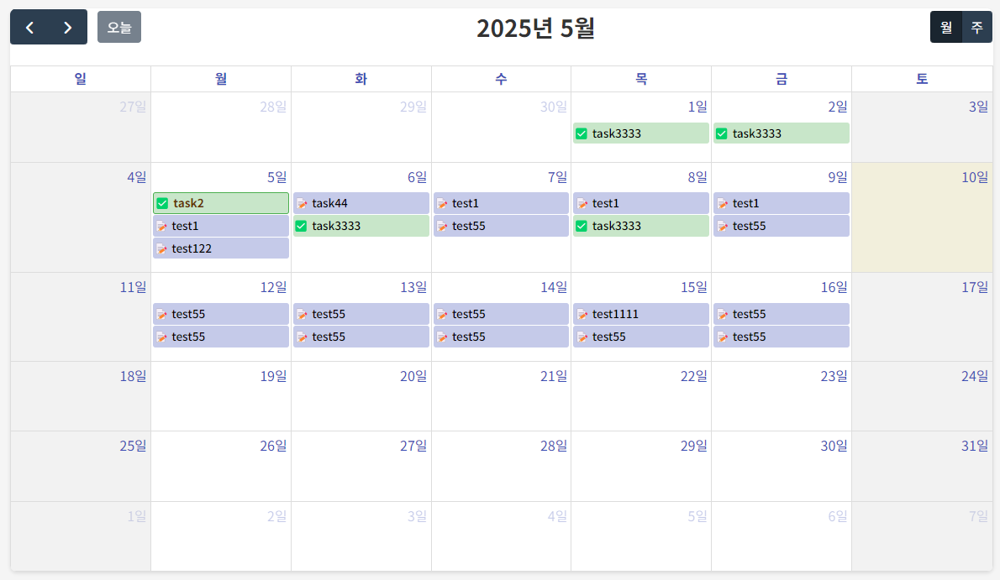
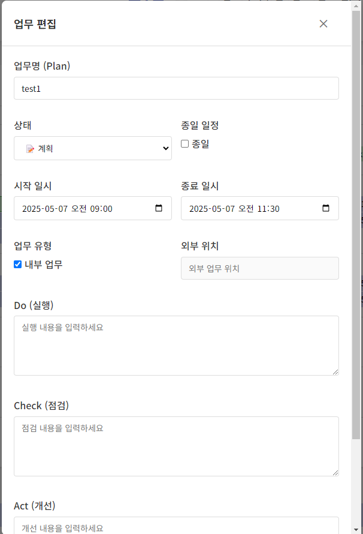
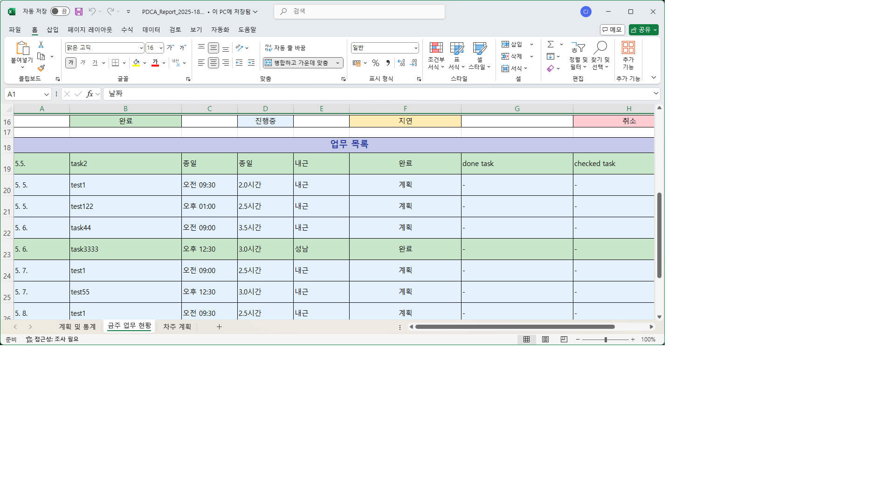

# csPDCA - PDCA 기반 일일 업무 관리 프로그램

PDCA(Plan-Do-Check-Act) 사이클 기반의 일일 업무 관리 윈도우 PC 프로그램입니다. 사용자는 개인의 업무(Plan)를 등록하고, 이에 대한 실행(Do), 점검(Check), 개선(Act) 과정을 효과적으로 관리할 수 있습니다.



## 주요 기능

### 사용자 관리
- 사용자 등록 및 로그인 시스템
- 보안 질문을 통한 비밀번호 복구 기능
- 세션 유지 (애플리케이션 재시작 시에도 로그인 상태 유지)

### 캘린더 및 업무 관리
- FullCalendar 기반의 직관적인 캘린더 인터페이스
- 드래그 앤 드롭으로 업무 생성, 편집, 이동, 복사 기능
- 업무 상태 시각화 (계획, 완료, 지연, 취소)
- 더블 클릭으로 새 업무 생성

### 계획 기능
- 월간 계획 카드 (간결한 카드 형식의 표시)
- 주간 계획 카드 (간결한 카드 형식의 표시)
- 업무 완료율 자동 계산

### 보고서 기능
- 주간 PDCA 보고서 생성
- 다중 시트 Excel 내보내기:
  - 시트 1: 월간 및 주간 계획/통계
  - 시트 2: 금주 업무 현황 (PDCA 상세 정보 포함)
  - 시트 3: 차주 계획 (가용 시)
- 업무 상태별 색상 코딩 및 필터링
- 업무 통계 시각화

### 데이터 관리
- 로컬 SQLite 데이터베이스를 통한 안전한 데이터 저장
- 오프라인 사용 지원
- 개인 정보 보호

## 스크린샷

### 캘린더 뷰


### 업무 편집


### Excel 보고서


## 개발 환경 사전 준비 사항 (SQLite 사용을 위함)

본 프로그램은 로컬 데이터베이스로 SQLite를 사용하며, `sqlite3` npm 패키지 설치 시 네이티브 모듈 빌드 과정이 필요합니다. 원활한 개발 환경 구성을 위해 다음 사항을 미리 확인하고 준비해주십시오.

1. **Node.js LTS 버전 설치 및 PATH 확인**
2. **Visual Studio Build Tools 설치 (워크로드: "C++를 사용한 데스크톱 개발")**
3. **Python 3.x 설치 및 PATH 확인**

## 설치 및 실행

1. 의존성 패키지 설치:
```bash
npm install
```

2. 개발 모드로 실행:
```bash
npm start
```

3. 렌더러 프로세스 빌드:
```bash
npm run build-renderer
```

4. 배포 패키지 생성:
```bash
npm run dist
```

## 프로젝트 구조

```
src/
├── main.js (Electron 메인 프로세스 진입점)
├── preload.js (렌더러 프로세스 브릿지 스크립트)
├── database.js (SQLite DB 설정 및 쿼리 헬퍼 함수)
├── excelExporter.js (Excel 생성 로직 모듈)
├── auth.js (사용자 인증, 등록, 세션 관리)
├── html/
│   ├── index.html (메인 애플리케이션 렌더링 HTML)
│   ├── login.html (로그인/등록 HTML)
│   └── styles.css (글로벌 및 컴포넌트 스타일)
└── renderer/ (React 앱 관련 소스)
    ├── components/ (재사용 가능한 React UI 컴포넌트)
    ├── pages/ (주요 화면 컴포넌트)
    ├── contexts/ (상태 관리)
    ├── hooks/ (커스텀 훅)
    ├── services/ (IPC 통신 래퍼)
    └── utils/ (유틸리티 함수)
```

## 데이터베이스 스키마

### Users 테이블
- 사용자 인증 및 개인 정보 저장

### Tasks 테이블
- PDCA 업무 데이터 저장 (Plan 내용)
- 업무 상태, 시작/종료 시간, 위치 정보 등 포함

### MonthlyPlans 테이블
- 월간 계획 내용 저장

### WeeklyPlans 테이블
- 주간 계획 내용 저장

## 기술 스택

- **프레임워크:** Electron
- **UI 라이브러리:** React
- **캘린더:** FullCalendar
- **데이터베이스:** SQLite
- **언어:** JavaScript (ES6+), HTML, CSS
- **스타일링:** 자체 CSS 스타일
- **폰트:** Google Fonts for Noto Sans KR
- **상태 관리:** React Context API
- **Excel 내보내기:** ExcelJS
- **패키징:** electron-builder

## 문서

- [요구사항 문서](docs/requirement_EN.md)
- [디자인 문서](docs/design_document.md)

## 라이선스

MIT License

## 개발자

개발: CSJO powered by Wind Software Team
